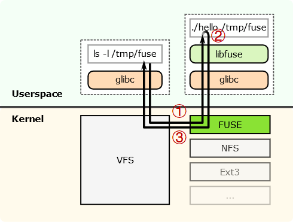
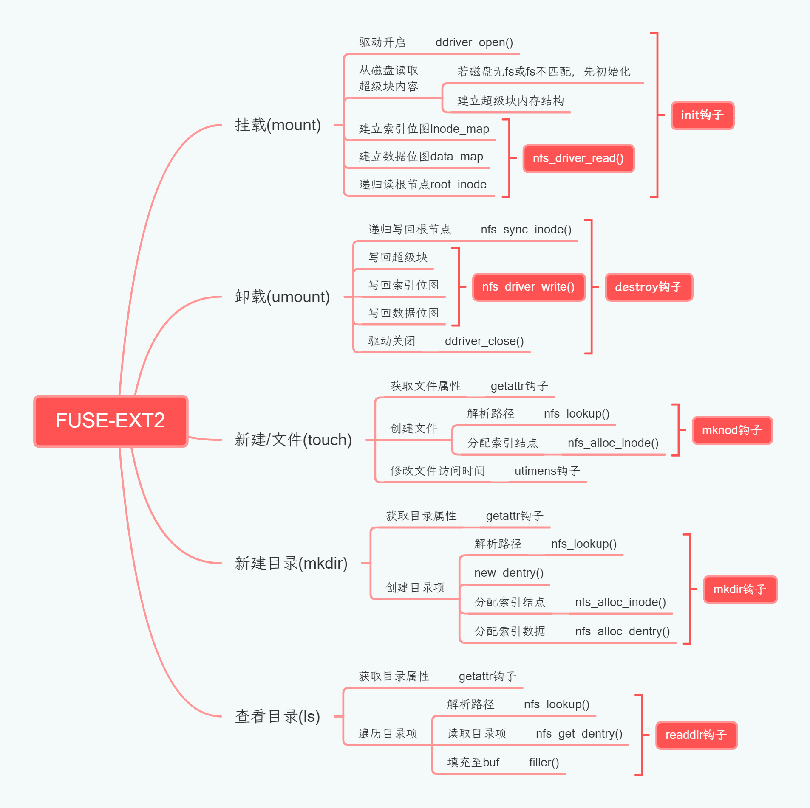

# HITsz-fuse-ext2-filesystem

> The repository is mainly for course project, aiming at file system teaching process.

哈工大（深圳）2021 年秋季学期「操作系统」[课程指导书](http://hitsz-lab.gitee.io/os-labs-2021)

基于 FUSE 架构，实现具有超级块、数据位图、索引位图等主要结构的 EXT2 文件系统，并具备挂载、卸载、创建文件、创建目录、查看目录的功能。

核心代码在 `fs/newfs` 下，参考 `fs/simplefs` 实现。

## 实验原理

### DDRIVER虚拟磁盘驱动

文件系统需要挂载到磁盘目录下，用以访问磁盘中的文件。本实验使用虚拟磁盘结构，来模拟挂载、卸载等操作。

DDRIVER 驱动模拟了一个容量为 4MiB 的磁盘，单次按块访问 IO 大小为 512B。本实验中磁盘块大小为 1024B，因此需要封装对磁盘的读写操作。

### EXT2文件系统

EXT2 是 GNU/Linux 系统中标准的文件系统，其特点是存取文件的性能较好，对于中小型的文件更显示其优势。常用于磁盘设备的访问。

EXT2 的系统规范将磁盘盘块组织为超级块、（组描述符）、位图、索引结点、数据块。本实验需要构造一个在 4MiB 磁盘下的文件系统，包括结构布局在磁盘、内存中不同的架构，参考 [总体设计](#总体设计)。

### FUSE框架

FUSE 架构将文件系统的实现由内核态搬到了用户态，因此可以在用户态实现我们的 EXT2 文件系统，从而可以和 Linux 本身的文件系统并存。

FUSE 架构可以截获对文件的访问请求（通过 VFS 到 FUSE 的内核模块），然后调用用户态注册的函数进行处理，最后将处理结果通过 VFS 返回给系统调用。

	

要接入 FUSE 框架，就需要通过一系列钩子函数（函数指针）来完成对应操作。

## 总体设计

	
    

## 实现功能

本系统实现的功能有：

- [x] mount
- [x] umount
- [x] ls
- [x] touch
- [x] mkdir
- [x] cd

-----

`mount`: **挂载 newfs 文件系统**

- 编译后以如下命令执行 nfs 文件： `./build/nfs --device={ddriverpath} -f -d -s {mntpath}`
- 其中 `{ddriverpath}` 是 `ddriver` 驱动的路径，`{mntpath}` 是挂载点路径，默认为 `./tests/mnt`。

> 在 vscode 中按下「F5」也可自动编译运行（调用 tasks.json 中的命令编译，调用 lauch.json 中的命令运行上述指令），运行后即可以实现挂载。

`umount`：**卸载 newfs 文件系统**

- 执行如下命令：`fusermount -u {mntpath}`

`ls`：**列出目录下的所有目录项**

- `ls`：列出当前目录下的所有目录项

- `ls {path}`：列出指定路径 `{path}` 下的所有目录项

`mkdir`：**新建目录**

- `mkdir {dirpath}`
- ``{dirpath}` 路径是一个目录，创建 `{dirpath}` 指向的目录，要求被创建目录之前的路径存在

`cd`：**更改当前工作目录**

- `cd {dirpath}`
- ``{dirpath}` 路径是一个目录，切换当前工作目录到 `{dirpath}` 所指向目录

`touch`：**新建文件**

- `touch {filepath}`
- ``{filepath}` 路径是一个文件，在 `{filepath}` 指向处创建一个新文件
