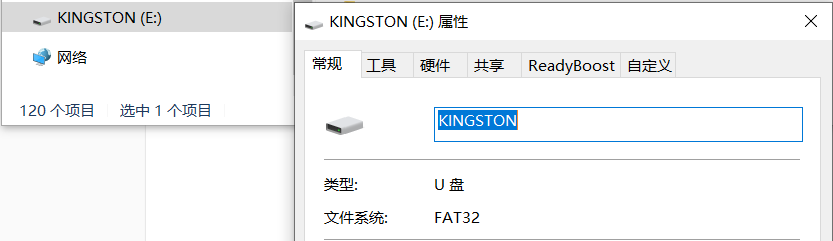
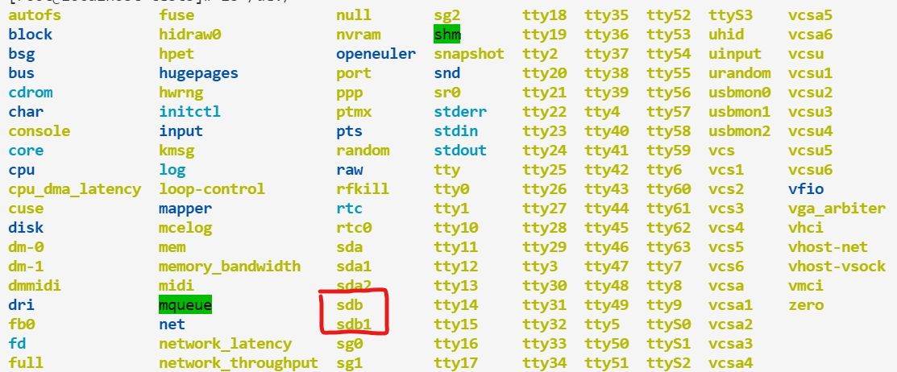
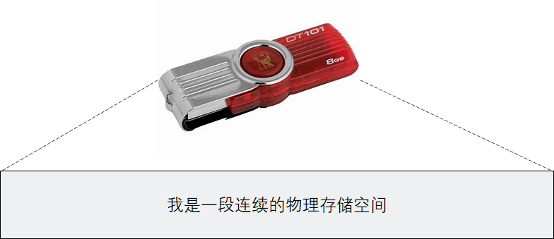
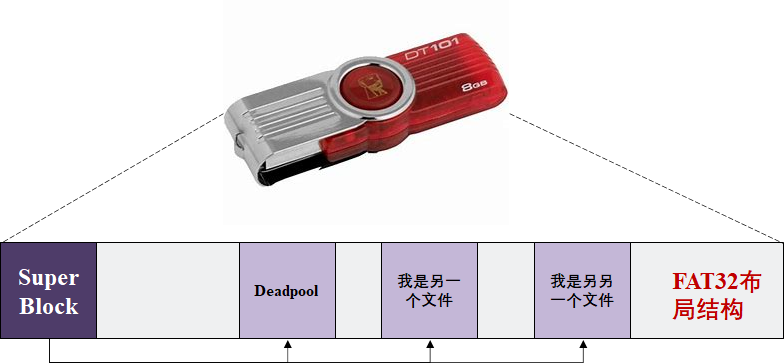
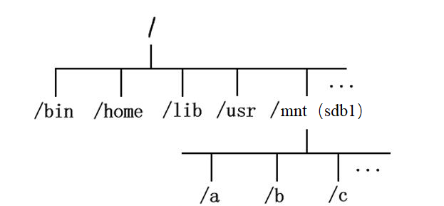
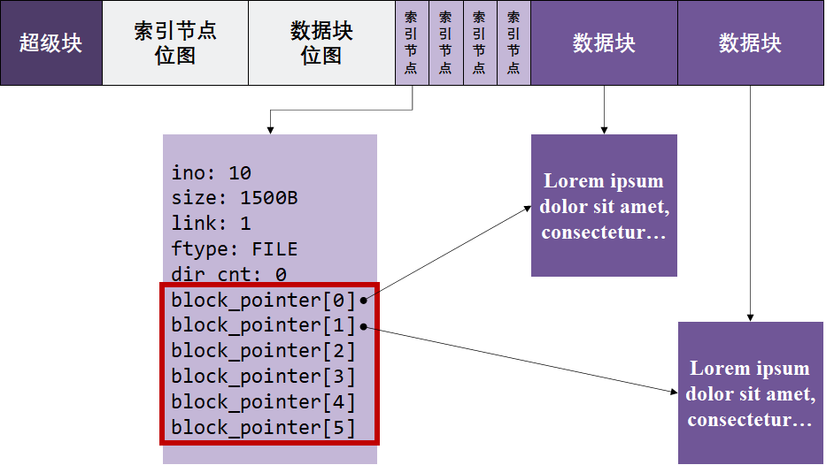
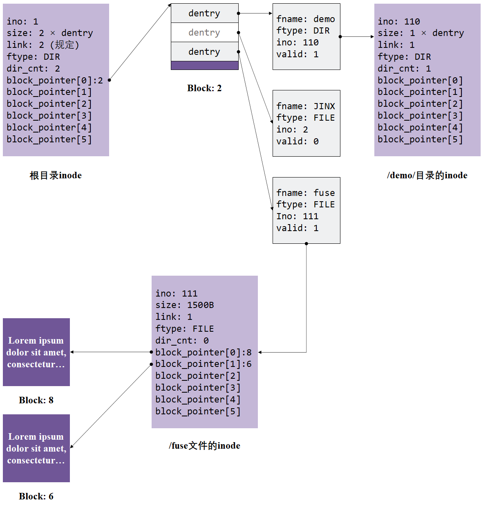
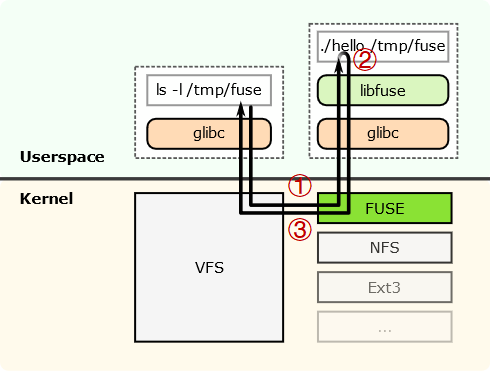

# 实验原理

## 1. EXT2文件系统原理简介

### 1.1 文件系统是什么

文件系统是**操作系统**用于明确**存储设备**（磁盘）或**分区**上的**文件（包括文件、目录、快捷方式等）**的方法和数据结构，即**在特定存储设备上组织文件的方法**。**简单地说**，文件就是在**特定存储设备上组织文件**的方法。

文件系统**主要作用**：

1. 管理和调度**设备的存储空间**，提供文件的逻辑结构、物理结构和存储方法;

2. 实现文件**从标识到实际地址的映射**，实现文件的控制操作和存取操作，提高**从设备上查找数据**的效率；

3. 实现文件信息的共享并提供可靠的**文件保密和保护措施**，提供文件的**安全措施**。

4. 优化设备空间利用率；

目前在各种操作系统中存在着各种各样的文件系统，在Windows平台主流有：**FAT、FAT16、FAT32、NTFS**等；在Unix平台主流的有：**EXT2、EXT3、EXT4**等。这些文件系统在**管理磁盘设备**时都有各自的一套策略和方法，随之也带来不同的优缺点。**EXT2**是GNU/Linux系统中标准的文件系统，其特点是**存取文件的性能较好**，对于中小型的文件更显示其优势。本实验以**EXT2**为模板，实现一个青春版文件系统。

### 1.2 文件系统的基本操作

#### 1.2.1 挂载

> [这里]([什么是挂载，Linux挂载如何实现详解 - 苍青浪 - 博客园 (cnblogs.com)](https://www.cnblogs.com/cangqinglang/p/12170828.html))有更多讲解挂载的资料

通常来讲，使用一个文件系统的第一步是**挂载（mount）**，那么，为什么我们在使用Linux的过程中没有这个步骤呢？这是由于操作系统为了简化用户操作，**自动帮助**我们进行了这个步骤。相关文件可以在`/etc/fstab`中查看：

```sh
[root@localhost tests]# cat /etc/fstab 
#
# /etc/fstab
# Created by anaconda on Sun Oct  3 03:53:55 2021
#
# Accessible filesystems, by reference, are maintained under '/dev/disk/'.
# See man pages fstab(5), findfs(8), mount(8) and/or blkid(8) for more info.
#
# After editing this file, run 'systemctl daemon-reload' to update systemd
# units generated from this file.
#
/dev/mapper/openeuler-root /                       ext4    defaults        1 1
UUID=ee2c1ea8-62de-4241-8742-7cba36a7eaf9 /boot    ext4    defaults        1 2
/dev/mapper/openeuler-swap none                    swap    defaults        0 0
```

这里以第一行为例，操作系统将设备`/dev/mapper/openeuler-root`以**EXT4**文件系统形式，挂载到根目录`/`下，从而让我们有了访问`/dev/mapper/openeuler-root`存储设备的能力。

**等等**，什么叫**将设备xxx**以**xxx文件系统**形式，**挂载**到**xxx目录**下？挂载到底是什么？我们来举个例子侃一侃。

- **Step 1：** 假设我们现在手里有一个金士顿U盘

  

- **Step 2：**现在，我们在主机上插入这个U盘

  在**Windows**系统上，可以看到下面的显示：

  

  **平时可能没有注意**，但这时，你可能注意到了金士顿U盘的**属性**中，有一栏告诉了我们这个U盘是**FAT32文件系统**。

  **事实上**，当我们插入U盘后，Windows**自动识别**出该U盘上文件存储的格式是FAT32，因此**它自动将金士顿U盘以FAT32文件系统格式挂载到了Windows目录结构**中。

  而在**Linux**系统上，我们可能并没有这么好的用户体验，当插入金士顿U盘后，我们只发现在`/dev`目录下多出了一个异类：

  

  一般来说，设备`sdb1`装文件的设备。那么，我们**是否可以向Windows那样，直接对它访问呢**？来试试：

  ```sh
  [root@localhost dev]# cd sdb1
  bash: cd: sdb1: Not a directory
  [root@localhost dev]# ls sdb1/
  ls: cannot access 'sdb1/': Not a directory
  ```

  很遗憾，并不行。这是因为**U盘sdb1**还没有被**挂载**到Linux目录下，此时Linux不知道这个U盘里面的文件是什么，只能知道这里这个有个U盘设备。

  我们知道这个U盘里装的是**FAT32**文件系统，在Linux中，**FAT32**又名**VFAT**，因此，我们可以尝试**将设备sdb1**以**VFAT文件系统**形式，**挂载**到**/mnt目录**下，通过访问**/mnt**目录来**查看U盘中的文件**：

  ```sh
  [root@localhost dev]# mount -t vfat sdb1 /mnt/
  [root@localhost dev]# ls /mnt/
  '???'                         '????PPT.pptx'
  '?????'                       '???????.pptx'
  '??????'                      '???_???_??_??_????.pptx'
  '???????'                      pynq_z2_v2.6.0.zip
  '????????'                     Deadpool
  ```

  **还真成了！**

- **Step 3：**现在，我们来缕一缕**挂载的逻辑**

  首先，我们可以将U盘抽象看作一段连续的存储空间：

  

  这个物理存储空间上用**FAT32类型**的文件系统保存着许多文件（可能FAT32文件布局不长下面这样，**不过差不多理解就行了**）

  

  接着，我们使用`mount`命令告诉Linux，这个U盘用的是FAT32文件系统，**你用FAT32文件系统代码规则来访问它就行了**。接着，我们同样要说明我们想**将哪个目录作为访问U盘的入口**，就在**/mnt**目录下吧！于是，我们便可以在**/mnt**目录下，以**FAT32**文件系统来访问U盘上的文件了。

  在我们用户来看，挂载了U盘后，Linux的目录树就变成下面这个样子了：

  

#### 1.2.2 卸载

**卸载操作**与**挂载操作**相对应，在Windows上来说，就类似于 **”右键U盘，安全弹出“** 一样。事实上，每个文件系统在开发的时候都要设计对应的**挂载与卸载**方法，它们需要**在卸载时**保存设备的必要状态（比如**当前设备的空闲大小**等）。**不正常的卸载会导致鲁棒性差的文件系统直接崩溃，也就是说<font color="red">下一次的挂载很可能直接失败</font>**

在Linux中，卸载文件系统的方式如下，我们还是以刚才挂载的金士顿U盘为例：

```sh
[root@localhost dev]# umount /mnt/
[root@localhost dev]# ls /mnt/
[root@localhost dev]#
```

此时，U盘对应的所有文件从Linux目录树中移除，我们便可以**正常拔除U盘**了。

#### 1.2.3 更多操作

其他更多相关文件系统的操作都比较常见，这里将一些常用指令再简单提一下：

- `ls`

  `ls`指令是`list`的缩写，其功能就是**列出指定目录下的所有文件/目录**，大家在学习**xv6**的过程中也有所接触，这里不在介绍；

- `mv`

  `mv`指令是`move`的缩写，其功能是**剪切**某个文件。事实上，`mv`指令还常常被用于**文件的重命名**操作，例如：

  ```sh
  [root@localhost mnt]# touch her
  [root@localhost mnt]# ls
  her
  [root@localhost mnt]# mv her me
  [root@localhost mnt]# ls
  me
  [root@localhost mnt]#
  ```

- `cp`

  `cp`指令是`copy`的缩写，其功能是**复制**某个文件，`cp -r`可以复制目录；

- `rm`

  `rm`指令是`remove`的缩写，其功能是**删除**某个文件，同样`rm -r`可以删除目录。当然，有一个业界梗：`rm -rf`删库跑路，这里`f`代表`force`，也就是强制删除。如果你一不小心使用了`rm -rf /`，那么你的Linux回天乏术了；

- `cd`

  `cd`指令是`change directory`的缩写，我们经常使用`cd`指令来进行路径的切换；

- `--help`

  上面说了一大堆，但远远还没把所有命令都介绍得完整、清楚，事实上，每个命令都有个`--help`参数可选，查看`--help`可以很快让你知道各个命令的用法、参数的意义，例如：

  ```sh
  [root@localhost mnt]# ln --help
  Usage: ln [OPTION]... [-T] TARGET LINK_NAME
    or:  ln [OPTION]... TARGET
    or:  ln [OPTION]... TARGET... DIRECTORY
    or:  ln [OPTION]... -t DIRECTORY TARGET..
  ...
  ```

  这里是查看**链接指令**`ln`的用法。

### 1.3 EXT2文件系统的构成

介绍完了文件系统以及文件系统的基本操作，我们来正式看看EXT2文件系统。

EXT2文件系统常常被用于**磁盘设备**的访问。一个物理磁盘可以划分为多个磁盘分区，每个磁盘分区可以从逻辑上看成是从0开始编号的大量扇区，各自可以格式化程不同类型的文件系统（如EXT2、NTFS等）。如果**格式化**成EXT2文件系统，则其内部按照EXT2的规范，将磁盘盘块组织成**超级块**、**组描述符**和**位图**、**索引节点**、**目录**等管理数据，放在分区前端称为**元数据区**，剩余空间用于**保存文件数据**。

这一段介绍中出现了两个新概念：**磁盘分区**与**格式化**，我们来简单理解一下：

- **磁盘分区**

  我们的笔记本通常只有一块SATA磁盘，为了方便用户进行数据管理，比如：我想划分磁盘的100个G作为游戏存放盘，400个G作为**<font color="darkyellow">学习资料</font>**。我想让游戏盘用**EXT2**管理，学习资料用**EXT3**管理，那么便有了磁盘分区的概念：

  

- **格式化**

  我们还是以金士顿U盘为例，U盘一生产出来就有文件系统吗？可能有：），但是很多时候刚出厂的U盘都是**干干净净**的，这个时候，我们需要对其进行**格式化**，使之带有特定文件系统的特征。例如，我们想用**EXT2**文件系统来访问这个U盘，在Linux中，就可以使用：

  ```sh
  [root@localhost mnt]# mkfs.EXT2 sdb1
  [root@localhost mnt]#
  ```

  这样做就把整个设备给格式化了，接着就可以用下面的命令来挂载U盘：

  ```sh
  [root@localhost mnt]# mount -t EXT2 sdb1 /mnt/
  [root@localhost mnt]#
  ```

#### 1.3.1 整体布局

EXT2文件系统将盘块分成两大类：保存元数据（管理数据）**的元数据盘块**，以及存放文件内容数据的**数据盘块**。本实验中，为了降低实验难度，简化了元数据区的结构（由超级块和inode数组构成）。简化后的EXT2文件系统的基本布局如下所示：


系统主要包含以下三个部分：

1. **superblock** ：超级块，包含整个系统的总体信息;
2. **索引节点位图**：记录着**索引节点**表的使用情况，**用1个比特**记录某一个索引节点是否被使用；
3. **数据块位图**：记录着**数据块**的使用情况，**用1个比特**记录某一个数据块是否被占用；
4. **索引节点**（inode） ：记录着文件的元数据，每个文件都与一个inode对应，但一个inode可能对应多个文件（硬链接）。在**本实验中可以认为一个inode对应一个文件**。
5. **数据块** ：记录文件内容;

#### 1.3.2 超级块

超级块是文件系统的**起点结构**，记录了文件系统全局性的一些信息。下面给出一个参考的超级块结构体示例：

```c
struct super_block_d
{
    uint32_t           magic_num;					// 幻数
    
    int                max_ino;						// 最多支持的文件数
    
    int                map_inode_blks;				// inode位图占用的块数
    int                map_inode_offset;			// inode位图在磁盘上的偏移
    
    int                map_data_blks;				// data位图占用的块数
    int                map_data_offset;				// data位图在磁盘上的偏移
};
```

- `magic_num`：幻数。用于识别文件系统。比如说，如果实现的文件系统幻数为**0x52415453**，那么如果读到的幻数不等于**0x52415453**，则表示当前磁盘中无系统，系统损坏，或者是其他不识别的文件系统；
- `max_ino`：最多支持的文件数。为简单起见，我们允许该文件系统具有文件数上限；
- `map_inode_blks`：inode位图占用的块数。每个**块的大小等于磁盘设备的IO大小（利用ddriver的ioctl获取）**；
- `map_inode_offset`：inode位图在磁盘上的偏移。通过`map_inode_offset`和`map_inode_blks`字段，便可读出整个inode位图；
- `map_data_blks`：与`map_inode_blks`相同，不再赘述；
- `map_data_offset`：与`map_inode_offset`相同，不再赘述；

**如何决定位图大小呢**？这里给出几个方案：

- 假设估算。**假定每个文件具有固定大小**，从而估算整个文件系统可以**管理多少文件**，从而计算位图大小；
- 规定大小。为了简单起见，我们可以自行**规定位图**的大小，只要**保证指令运行成功**即可；

#### 1.3.3 文件的表示

对于每个文件，都会有一个inode结构体包含其元数据（文件类型，文件大小）等。以下是一个简化的inode示例。

```c
struct inode_d
{
    int                ino;                          // 在inode位图中的下标
    int                size;                         // 文件已占用空间
    int 			   link;						 // 链接数
    FILE_TYPE      	   ftype;   					 // 文件类型（目录类型、普通文件类型）
	int                dir_cnt;					     // 如果是目录类型文件，下面有几个目录项
    int 		   	   block_pointer[6];			 // 数据块指针（可固定分配）
};  
```

文件的内容并**不会保存**在inode里，而是**保存**在另外的**数据块**中。inode里**保存了相应数据块的索引值**。读写文件时则通过索引值找到相应的数据块来读写。原理如下图所示：



每个索引节点内包含`block_point`数组用于记录文件的数据块所在位置（编号）。**EXT2**文件系统中的**每个数据块大小为两个512B的物理磁盘块**（即1KiB），那么采用直接索引方式，一个文件不能超过 6个（数据块） * 1KB（数据块大小）= 6KB大小；当文件超过6KB时，需要用一级间接索引，如果文件继续增大，就需要二级或二级以上间接索引。（ **注：间接索引属于选做功能** ）

- `link`：文件链接数（ **注：文件软链接与硬链接属于选做功能** ）

- `ftype`：文件类型。可自定义枚举类型，方便编码，例如：

   ```c
   typedef enum file_type {
       FILE,						// 普通文件
       DIR							// 目录文件
   } FILE_TYPE;
   ```

#### 1.3.4 文件夹（目录）的表示

文件夹（目录）用于将整个文件系统的文件结构**按路径名访问的树形组织结构排列**。Ext2文件系统并没有单独形成用于目录数据的数据块，而是**将目录与普通文件一样存放在数据块中**。也就是说，**文件夹（目录）在Ext2中的存储方式与文件一致**。不同之处在于目录在数据块中的内容由文件系统直接管理，用户并不能像写普通文件一样直接使用编辑器写目录数据块中的内容。

目录在存储管理上和普通文件相同——也是**通过索引节点来管理目录项数据的**，只不过目录数据块内容含有多条目录项数据结构，即目录数据块中的内容是目录项的数组，通过上一级目录项将其类型标识为“目录”以区分普通文件。

**根目录有固定的起点**（例如Ext2文件系统根目录的索引号为2），因此根目录文件就不需要上级目录来定位了。

下面是简化的**目录项**结构体示例：

```c
struct dentry_d
{
    char               fname[MAX_FILE_NAME];		  // 指向的ino文件名
    FILE_TYPE      	   ftype;						  // 指向的ino文件类型
    int                ino;                           // 指向的ino号
    int				   valid;						  // 该目录项是否有效
};  

```

对于目录中的每一个目录项都对应了当前目录下的一个文件/目录。具体表示方式见下图：



图中`/`目录下第二个名为`JINX`的目录项的`valid`字段被标记为0，**表示这一文件已被删除**。当然也可以使用其他的删除方式，比如**用后面的目录项覆盖被删除的目录项**。

图中`/demo/`目录指向的数据块没有画出，其原理与根目录一致。

#### 1.3.5 内存结构表示

大家可能注意到我们**前面展示的数据结构**后面都带有一个`_d`，事实上，这代表这些数据结构是存在于真实设备之上的，它们共同构建了文件系统的布局。但文件系统**结构布局**与**文件系统**两者还是有一定的偏差。这是因为文件系统不光要设计布局，还需要**针对布局**设计相应的**内存数据结构**来方便管理。

我们举两个简单的例子来说明这个问题。

- **super_block**的内存表示

  在设备上，超级块中仅仅保存了文件系统的位图位置，我们需要**将位图读到内存中以便我们进行访问**；此外，为了方便查找根目录，我们也完全可以将根目录维护在超级块的内存表示中，以便我们全局访问。因此，可以简单设计超级块的内存表示如下：

  ```c
  struct super_block
  {   
      int                max_ino;
      
      uint8_t*           map_inode;					// inode位图
      uint8_t*		   map_data;					// data位图
  
      struct dentry* 	   root_dentry;					// 根目录dentry
  };
  ```

  这样，我们就能方便地对**inode位图**和**data位图**进行管理，并能够通过`root_dentry`轻松访问根目录，从而达到**快速解析路径**的目的。

- **inode**的内存表示

  在磁盘布局中，我们的`inode`定义如下：

  ```c
  struct inode_d
  {
      int                ino;                          // 在inode位图中的下标
      int                size;                         // 文件已占用空间
      int 			   link;						 // 链接数
      FILE_TYPE      	   ftype;   					 // 文件类型（目录类型、普通文件类型）
  	int                dir_cnt;					     // 如果是目录类型文件，下面有几个目录项
      int 		   	   block_pointer[6];			 // 数据块指针（可固定分配）
  };  
  ```

  这个结构难以对指向`inode`的`dentry`进行访问，也就难以获得该文件的文件名。此外，对于**目录文件**而言，它缺少一种**快捷遍历每个目录项**的方法，因此，可以简单设置`inode`的内存结构如下：

  ```c
  struct inode
  {
      int                ino;                           // 在inode位图中的下标
      int                size;                          // 文件已占用空间
      int                dir_cnt;						  // 目录项数量
      struct dentry* 	   dentry;                        // 指向该inode的dentry
      struct dentry* 	   dentrys;                       // 所有目录项  
      int 		   	   block_pointer[6];			  // 数据块指针
  };  
  ```

  这样一来，我们通过维护`dentry`和`dentrys`就能够很轻松地解决上述问题。

这里给出的例子仅起一个抛砖引玉的作用，你**甚至可以不设计这种内存结构**，例如：直接声明**位图**、**根目录dentry**为全局变量等。

## 2. FUSE（Filesystem in User SpacE）架构

传统的、基于Linux的文件系统开发都是以内核模块（**Kernel Module**）的方式进行，这使得开发调试变得异常繁琐。此外，内核的开发与传统C程序开发不同，你需要使用内核的API，像`malloc`之类的用户态函数在内核开发中已不再适用。如果有同学希望了解更多内核模块开发相关知识，可以自行google或百度。

由于内核文件系统开发的困难，FUSE架构由此登上了台面。FUSE全称Filesystem in User SpacE，它将**文件系统的实现从内核态搬到了用户态**，也就是我们可以**在用户态实现一个文件系统**。

本次实验我们便是基于FUSE架构，**在用户态**实现我们的青春版EXT2文件系统，从而完美接入Linux。

接下来，我们简单介绍一下FUSE，当然，如果对FUSE不感兴趣的同学可以略过这一章节。在**实验步骤**一节中中，我们会详细介绍如何接入FUSE。

> 以下内容参考自[用户态文件系统框架FUSE的介绍及示例 - 知乎 (zhihu.com)](https://zhuanlan.zhihu.com/p/59354174)

### 2.1 FUSE基本原理

简单的理解，**FUSE实现了一个对文件系统访问的回调**。FUSE分为**内核态的模块和用户态的库**两部分。其中**用户态的库**为**用户态程序开发**提供接口，我们通过这些接口**将请求处理功能注册到FUSE中**。**内核态模块**是具体的数据流程的功能实现，它**截获文件的访问请求，然后调用用户态注册的函数进行处理**。



如上图所示，其中**hello**是用户态的文件系统程序，**该程序启动的时候会将自己开发的接口注册到FUSE中**，**比如读写文件的接口，遍历目录的接口**等等。同时，**通过该程序在系统某个路径挂载FUSE文件系统**，比如`/tmp/fuse`。此时**如果在该目录中有相关操作**时，请求会经过**Linux虚拟文件系统**（[VFS](https://blog.csdn.net/weixin_36145588/article/details/73607463)）层**到FUSE的内核模块**（如调用`ls`命令，如上图中的步骤①），**FUSE内核模块根据请求类型**，调用**用户态应用注册**的函数（上图中步骤②），然后**将处理结果通过VFS返回给系统调用**（步骤③）。

### 2.2  示例及说明

> 获取实验包的方法：git clone xxx

在我们提供的实验包中，已经有两个完全搭建好的FUSE文件系统：`simplefs`（`fs/simplefs`文件夹下）和`myfs`（`fs/samples`文件夹下），其中`simplefs`是一个类EXT2的文件系统，但**没有给予数据位图**的实现；`myfs`是`github`上的一个开源项目，也是一个FUSE文件系统实例。

此外，这里我们给一个极简的Demo。该Demo非常简单，它并不是一个真正的文件系统，**也不会访问设备**，而是在**该文件系统**的根目录中**显示一个固定的文件**，也就是`Hello-FUSE`文件。

```c
/* main.c源码 */

#define FUSE_USE_VERSION 26
#include <stdio.h>
#include <fuse.h>

/* 这里实现了一个遍历目录的功能，当用户在目录执行ls时，会回调到该函数，我们这里只是返回一个固定的文件Hello-FUSE。 */
static int test_readdir(const char* path, void* buf, fuse_fill_dir_t filler, off_t offset, struct fuse_file_info* fi)
{
 
    return filler(buf, "Hello-FUSE", NULL, 0);
}

/* 显示文件属性 */
static int test_getattr(const char* path, struct stat *stbuf)
{
    if(strcmp(path, "/") == 0)
        stbuf->st_mode = 0755 | S_IFDIR;			// 说明该文件是目录文件
    else
        stbuf->st_mode = 0644 | S_IFREG;			// 说明该文件是普通文件
    return 0;
}

/*这里是回调函数集合，这里实现的很简单*/
static struct fuse_operations ops = {
   .readdir = test_readdir,
   .getattr = test_getattr,
};

int main(int argc, char *argv[])
{
     int ret = 0;
     ret = fuse_main(argc, argv, &ops, NULL);
     return ret;
}
```

接下来，编译运行`main.c`文件

```sh
gcc -o hello main.c -D_FILE_OFFSET_BITS=64 -lfuse
```

假设在`/tmp`目录下面有一个`fuse`目录，如果没有可以手动创建一个。然后执行如下命令可以在该目录挂载新的文件系统。

```sh
[root@localhost test]# ./hello /tmp/fuse
```

**注意**，**FUSE文件系统的挂载与传统文件系统**的挂载略有不同，它**不用mount选项**，直接运行二进制文件就可完成挂载。上面命令的意思是将文件系统`hello`挂载到`/tmp/fuse`。

此时运行`ls`命令看看效果：

```sh
[root@localhost tmp]# ls /fuse
Hello-FUSE
[root@localhost tmp]# 
```

可以看出正式我们期望的内容，也就是只有一个名为`Hello-FUSE`的文件。

至于如何**利用FUSE文件系统挂载设备**、**如何创建文件**，我们将在**<font color="red">实验步骤</font>**中进行详细描述。

## 3. DDRIVER虚拟磁盘驱动

本次实验提供了虚拟磁盘接口，头文件`ddriver.h`中提供了完备的注释。该接口底层实现简单，且基本符合POSIX规范（即与标准`write`、`read`、`lseek`、`ioctl`等接口保持一致）。**唯一需要注意的是我们对单次读取、写入的IO大小做出了限制，保证其与磁盘块大小对齐**。其中，IO大小为512B，你也可以通过`ddriver_ioctl`来请求IO大小，具体我们在**<font color="red">实验步骤</font>**中介绍。

**DDRIVER驱动**模拟了**对一个容量为4MiB的磁盘**的操作，同样，4MiB可以通过`ddriver_ioctl`函数访问得到。其中需要注意的是它**保留了磁盘的访问特性**，即**按块访问**，每次读写都需要**读写完整的512B**的磁盘块。这将引起一些很麻烦的情况，比如说要更新某个磁盘块中的某个inode时，需要先把整个磁盘块读出来，更新相应inode，再写回去，而不是直接往磁盘里写（除非一个inode比一个磁盘块大）。

以下是DDRIVER驱动提供的头文件`ddriver.h`

```c
#ifndef _DDRIVER_H_
#define _DDRIVER_H_

#include "ddriver_ctl_user.h"
#include "stdio.h"

/**
 * @brief 打开ddriver设备
 * 
 * @param path ddriver设备路径
 * @return int 0成功，否则失败
 */
int ddriver_open(char *path);

/**
 * @brief 移动ddriver磁盘头
 * 
 * @param fd ddriver设备handler
 * @param offset 移动到的位置，注意要和设备IO单位对齐
 * @param whence SEEK_SET即可
 * @return int 0成功，否则失败
 */
int ddriver_seek(int fd, off_t offset, int whence);

/**
 * @brief 写入数据
 * 
 * @param fd ddriver设备handler
 * @param buf 要写入的数据Buf
 * @param size 要写入的数据大小，注意一定要等于单次设备IO单位
 * @return int 0成功，否则失败
 */
int ddriver_write(int fd, char *buf, size_t size);

/**
 * @brief 读出数据
 * 
 * @param fd ddriver设备handler
 * @param buf 要读出的数据Buf
 * @param size 要读出的数据大小，注意一定要等于单次设备IO单位
 * @return int 
 */
int ddriver_read(int fd, char *buf, size_t size);

/**
 * @brief ddriver IO控制
 * 
 * @param fd ddriver设备handler
 * @param cmd 命令号，查看ddriver_ctl_user，IOC_开头
 * @param ret 返回值
 * @return int 0成功，否则失败
 */
int ddriver_ioctl(int fd, unsigned long cmd, void *ret);

/**
 * @brief 关闭ddriver设备
 * 
 * @param fd ddriver设备handler
 * @return int 0成功，否则失败
 */
int ddriver_close(int fd);

#endif /* _DDRIVER_H_ *
```

**值得一提的是**，**DDRIVER**的实现有两个版本：**内核版本**和**用户版本**。其中，**内核版本**的编写是采用**内核模块**的方式，代码位于`/driver/kernel_ddriver`下，由于本次实验环境所致，内核版本暂停使用，如果大家有兴趣也可以去参考一下一个内核模块的编程方法；**用户版本**位于`/driver/user_ddriver`下，用户版本的编译方式是静态链接库，因此你无法直接通过Debug调试进入到上述接口实现的代码中，**这也是为了模拟真实驱动所做的考虑**。

## 4. 磁盘缓存简介（选做内容）

**磁盘的访问速度远小于内存的访问速度**，而现实中磁盘的容量也远大于内存，所以为了提速**把整个磁盘内容读到内存中是不现实的**。但是，我们还是有一些手段提高对磁盘的访问速度。**根据局部性原理**，最近被访问过的空间接下来也很可能被访问到，所以我们可以做**一些缓存块**，把**最近最常被访问的数据放入缓存块中**。如何管理缓存块，采取怎样的**替换策略**，以及在什么时机下**写回**，如何保证**一致性**，这些都是磁盘缓存需要考虑的问题。

## 5. 日志文件系统简介（选做内容）

日志机制是提高文件系统鲁棒性的一个重要机制。我们知道，**文件系统的很多操作往往不止一个步骤**，以创建文件为例，它要经过：**写文件inode**、**写目录项**、**更新位图**三个步骤。

如果在写完目录项但没开始写超级块时发生了**系统崩溃**或者停电**等因素导致宕机**，那么第一步被分配出去的inode就无法被记录为已分配，重启系统后文件系统有可能把这一inode分配给其他文件。

为了保证整个过程的**原子性**，我们可以加入日志机制。在磁盘中划出一块区域记为日志区。一开始不把更新后的数据写入数据区，而是把日志区状态记为记录中，并把更改写入日志区。写入完成后，把日志区状态改为写入中，并把日志区的更改更新到数据区。全部更新完成后，把日志区状态记为空闲。

如果在记录时系统崩溃，在重启后会发现日志区状态为记录中。此时只需简单地丢弃日志内容，改状态为空闲，即可。这种情况下文件创建就好像从未发生过一样。

如果在写入时系统崩溃，在重启后会发现日志区状态为写入中。此时日志区的更新信息是完整的，只是不知道崩溃前写到了哪一步。此时只要把日志区的信息全部重新写入到数据区，再把状态记为空闲，即可恢复被打断的操作。

