#  实验步骤

## 1. 环境搭建与上手

### 1.1 实验包结构介绍

本次实验充分考虑到**上手成本**，因此我们编写了简单的环境配置脚本，帮助大家一键配置开发环境。实验包代码获取途径：

```sh
git clone xx/user-land-filesystem.git
```

实验包的结构如下：

```sh
user-land-filesystem/
├── docs
│   ├── part1.md
│   ├── part2.md
│   ├── part3.md
│   └── part4.md
├── driver
│   ├── ddriver.sh
│   ├── kernel_ddriver
│   └── user_ddriver
├── fs
│   ├── samples
│   ├── simplefs
│   └── template
├── LICENSE
├── README.md
├── setenv.sh
└── tests
    ├── README.md
    └── test_ddriver
```

- `docs` 

  就是本指导资料。

- `driver`

  存放驱动代码。其中`kernel_ddriver`为内核驱动，`user_ddriver`为用户驱动，`ddriver.sh`为控制**ddriver**驱动的脚本，可以运行如下命令尝鲜：

  ```
  [root@localhost user-land-filesystem]# ./driver/ddriver.sh 
  ```

- `fs`

  存放**实现的FUSE文件系统**。其中`samples`为`myfs`文件系统，`simplefs`为类EXT2文件系统（缺少数据位图），`template`用于生成文件系统的代码结构，可忽略。

- `LICENSE`

  开源许可，本实验遵循**GPL v3**开源许可。

- `tests`

  该文件夹存放DDRIVER用户驱动代码。

- ` setenv.sh`

  用于配置FUSE文件系统开发环境。

### 1.2 配置开发环境

运行`./setenv.sh`后，即可按照指导一步一步来建立环境：

```sh
teststu_8@OSLabExecNode0:~/user-land-filesystem$ ./setenv.sh 
请输入工作目录名称 ([工作]目录将被至于./fs目录下): newfs
...
生成工作路径:  /home/guests/teststu_8/user-land-filesystem/fs/newfs
请输入项目名称: newfs
...
```

其中，工作目录名称即开发该文件系统的**文件夹名称**。可以看到，它在`fs`目录下新建了一个`newfs`目录作为工作目录。

接着，项目名称即真正的文件系统名称，可以是文件系统的简写，例如：nfs（代表newfs），这里要注意项目名不能有**特殊符号、空格**等。

项目建立完成之后的结构`newfs`如下所示：

```sh
./fs/newfs/
├── .vscode
├── CMake
│   └── FindFUSE.cmake
├── CMakeLists.txt
├── include
│   ├── ddriver_ctl_user.h
│   ├── ddriver.h
│   ├── newfs.h
│   └── types.h
├── README.md
├── SPEC.txt
├── src
│   └── newfs.c
└── tests
    └── fs_test.sh
```

这个结构可以自行修改添加，不过要记得**重新配置CMake**。本次实验要求很简单，跑过`tests`下的`fs_test.sh`就算完成。

### 1.3 DDRIVER脚本的运用

为了方便对**ddriver**设备进行控制，我们将`ddriver.sh`脚本链接到了**Linux命令系统**中，这样，同学们就可以在**任何目录**下访问到`ddriver.sh`脚本。该脚本的主要用途如下：

```sh
teststu_8@OSLabExecNode0:~/$ ddriver 

====================================================================
]]]]]]]]    ]]]]]]]]             
]      ]]   ]      ]]   ]   ]]   ]]   ]]    ]]    ]-------]   ]   ]]   
]       ]   ]       ]   ] ]]     ]]    ]]  ]]     ]_______/   ] ]]     
]      ]]   ]      ]]   ]]       ]]     ]  ]      \           ]]      
]]]]]]]]    ]]]]]]]]    ]]       ]]      ]]        ]]]]]]]]   ]]  
====================================================================
    
用法: ddriver [options]
options: 
-i [k|u]      安装ddriver: [k] - kernel / [u] - user
-t            测试ddriver[请忽略]
-d            导出ddriver至当前工作目录[PWD]
-r            擦除ddriver
-l            显示ddriver的Log
-v            显示ddriver的类型[内核模块 / 用户静态链接库]
-h            打印本帮助菜单
====================================================================
```

常用的功能是`-v`、`-d`与`-r`，它们的用途分别是**查看ddriver设备类型及设备位置**、**将ddriver设备镜像导出到当前目录下**、**将ddriver设备擦除干净**。用法如下：

```sh
====================================================================
# 查看设备位置和类型
teststu_8@OSLabExecNode0:~$ ddriver -v
静态链接库设备: /home/guests/teststu_8/ddriver
teststu_8@OSLabExecNode0:~$ 

====================================================================
# 将ddriver设备导出到当前目录下
teststu_8@OSLabExecNode0:~/$ ddriver -d
[sudo] password for teststu_8: 
目标设备 /home/guests/teststu_8/ddriver
8192+0 records in
8192+0 records out
4194304 bytes (4.2 MB, 4.0 MiB) copied, 0.094218 s, 44.5 MB/s
文件已导出至/home/guests/teststu_8/ddriver_dump，请安装HexEditor插件查看其内容
teststu_8@OSLabExecNode0:~/$ ls
ddriver_dump 
teststu_8@OSLabExecNode0:~/$

====================================================================
# 将ddriver设备擦除干净
teststu_8@OSLabExecNode0:~/$ ddriver -r
目标设备 /home/guests/teststu_8/ddriver
8192+0 records in
8192+0 records out
4194304 bytes (4.2 MB, 4.0 MiB) copied, 0.0506111 s, 82.9 MB/s
teststu_8@OSLabExecNode0:~/$ cat ./ddriver_dump
teststu_8@OSLabExecNode0:~/$
```

### 1.4 项目编译

项目编译的过程在新建项目的`SPEC.txt`文件中有所交代，这里提出来讲一讲：

- **Step 1**. SSH打开`./fs/newfs`

  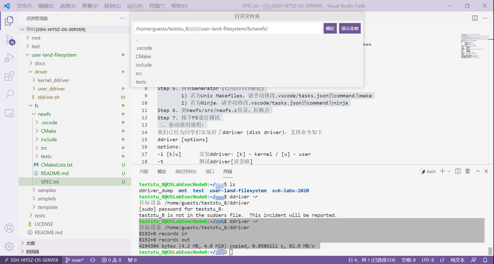

- **Step 2**. 打开CMakeLists.txt文件

- **Step 3**. ctrl + shift + p呼出命令菜单

- **Step 4**. 输入CMake: Configure

- **Step 5**. 查看Generator (已用!!!!!标记)

  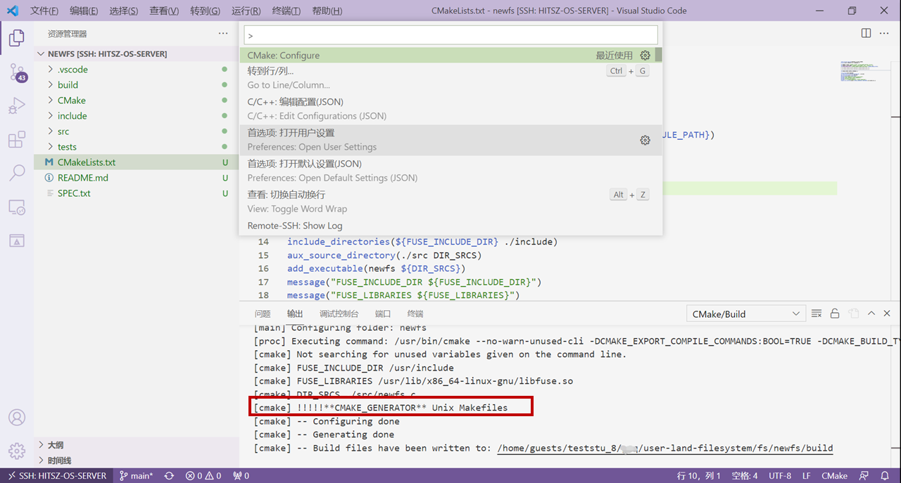

  若**CMAKE_GENERATOR**为**Unix Makefiles**，请手动修改`.vscode/tasks.json`的`command`为`make`，若为**Ninja**，请手动修改`.vscode/tasks.json`的`command`为`ninja`，如下图所示：

  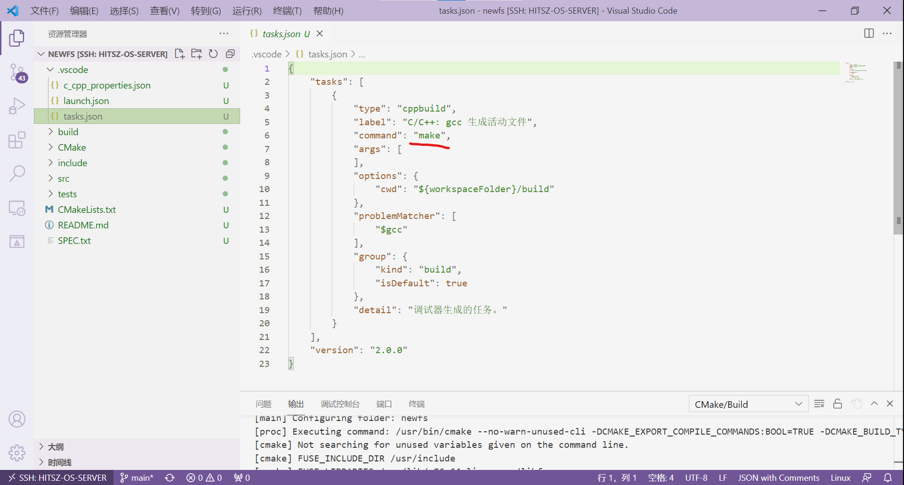

- **Step 6**. 到`newfs/src/newfs.c`目录，打断点

- **Step 7**. 按下F5进行调试 

  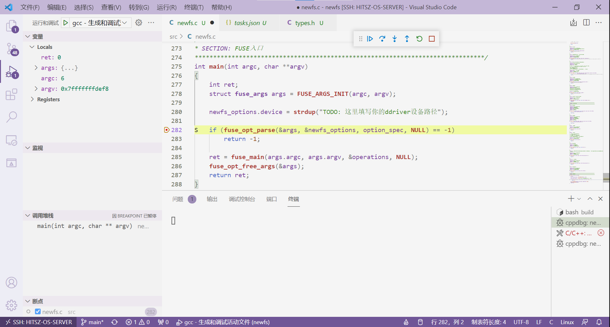

编译运行原理：

- **编译。**编译环节利用CMakeLists工程自动帮助我们编译，这里要安装CMake Tools等拓展，相信大家前面也装过了。其中，按下F5后，VSCode会首先运行`.vscode`目录下`tasks.json`中的命令：

  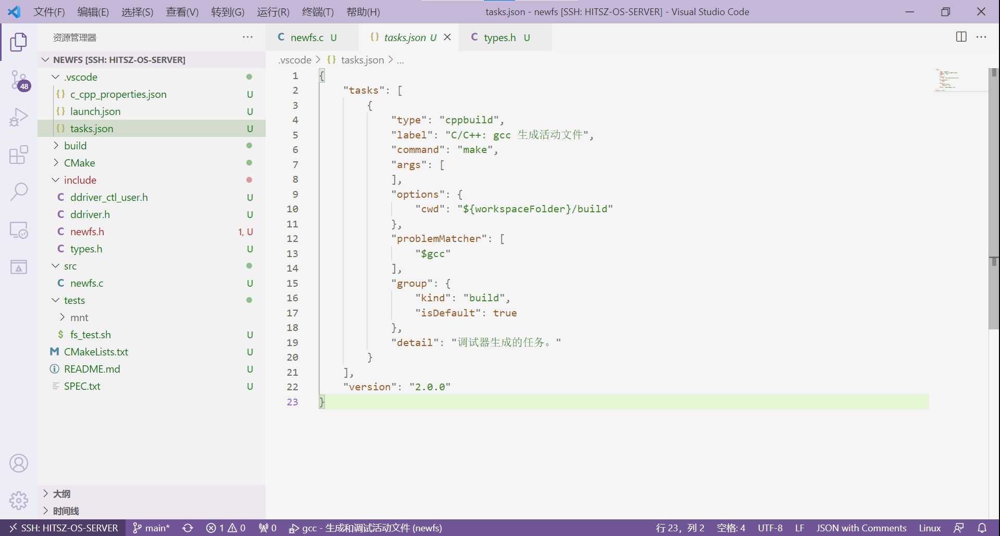

  该命令执行的操作就是在CMakeLists生成的`build`目录下运行`make`，由此完成自动编译。

- **运行。**运行过程是在`.vscode`目录下`launch.json`中定义：

  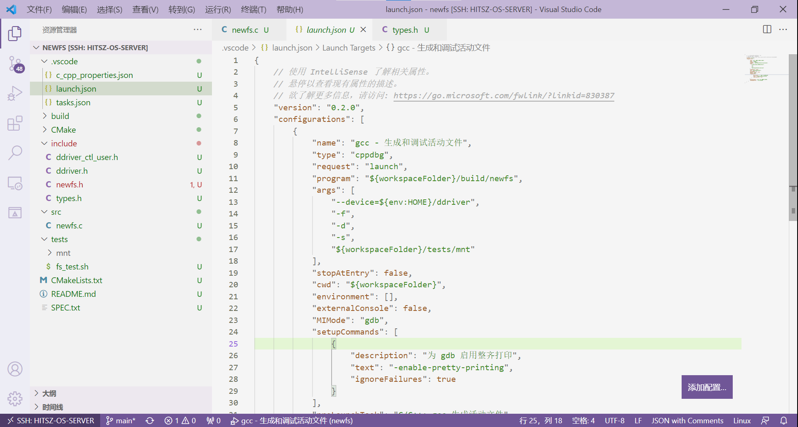

  把运行命令展开实际上是：

  ```sh
  teststu_8@OSLabExecNode0:~/user-land-filesystem/fs/newfs$ ./build/newfs --device=/home/guests/teststu_8/ddriver -f -d -s ./tests/mnt/
  ```

  正如我们前面**实验原理 - FUSE架构**中说到的那样，**FUSE文件系统**的挂载不需要使用`mount`命令，而是直接用编译出来的二进制文件。上述命令的意义为：**将设备/home/guests/teststu_8/ddriver**以**newfs文件系统**形式，**挂载**到**./tests/mnt目录**下。
  
  进而衍生出**FUSE文件系统**的**卸载**，同样，与传统内核文件系统卸载不同，它的卸载命令为：
  
  ```sh
  teststu_8@OSLabExecNode0:~/user-land-filesystem/fs/newfs$ fusermount -u ./tests/mnt
  teststu_8@OSLabExecNode0:~/user-land-filesystem/fs/newfs$ 
  ```
  
  这里使用`fusermount -u`命令进行FUSE文件系统的卸载。

## 2. 任务一：**熟悉DDRIVER驱动** 

任务一要求熟悉DDRIVER驱动，我们要求大家根据注释看懂`user-land-filesystem/tests/test_ddriver/src/test.c`的代码，并**根据提示**修改其中的**<font color="red">一处错误</font>**：

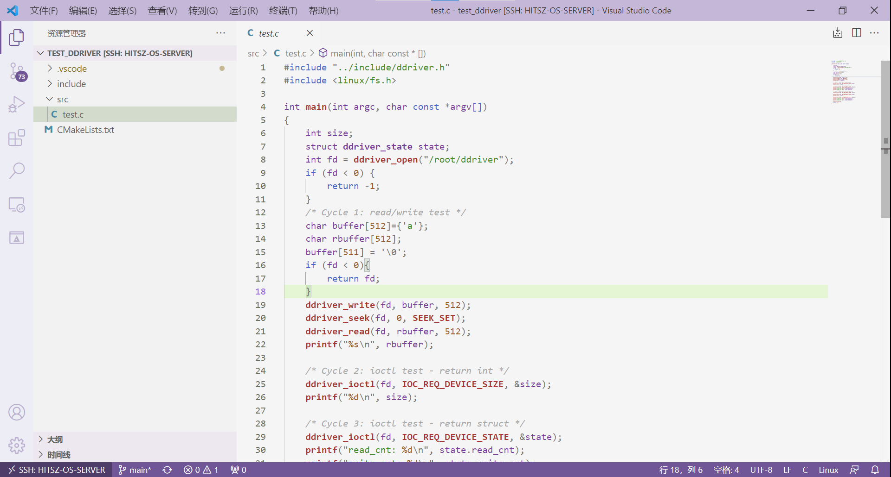

编译运行测试程序的步骤：

```sh
teststu_8@OSLabExecNode0:~/user-land-filesystem/tests/test_ddriver$ cmake CMakeLists.txt 
...
teststu_8@OSLabExecNode0:~/user-land-filesystem/tests/test_ddriver$ make
...
teststu_8@OSLabExecNode0:~/user-land-filesystem/tests/test_ddriver$ ./ddriver_test 
```

## 3. 任务二：基于FUSE实现青春版EXT2文件系统

熟悉了驱动后，我们也就基本掌握了访问**DDRIVER**设备的方法。接下来我们就可以基于FUSE来正式编写**青春版EXT2文件系统**了。我们已经在**环境配置**阶段就为大家搭建好了FUSE文件系统项目框架。

要接入一个框架，那么少不了钩子函数（也可称为**函数指针**）。钩子函数**是一系列函数的抽象**，从而让C语言具有多态的性质。对于FUSE框架，其给我们的接口**如下**。

```c
struct fuse_operations {
	int (*getattr) (const char *, struct stat *);
	int (*readlink) (const char *, char *, size_t);
	int (*getdir) (const char *, fuse_dirh_t, fuse_dirfil_t);
	int (*mknod) (const char *, mode_t, dev_t);
	int (*mkdir) (const char *, mode_t);
	int (*unlink) (const char *);
	int (*rmdir) (const char *);
	int (*symlink) (const char *, const char *);
	int (*rename) (const char *, const char *);
	int (*link) (const char *, const char *);
	int (*chmod) (const char *, mode_t);
	int (*chown) (const char *, uid_t, gid_t);
	int (*truncate) (const char *, off_t);
	int (*utime) (const char *, struct utimbuf *);
	int (*open) (const char *, struct fuse_file_info *);
	int (*read) (const char *, char *, size_t, off_t,
		     struct fuse_file_info *);
	int (*write) (const char *, const char *, size_t, off_t,
		      struct fuse_file_info *);
	int (*statfs) (const char *, struct statvfs *);
	int (*flush) (const char *, struct fuse_file_info *);
	int (*release) (const char *, struct fuse_file_info *);
	int (*fsync) (const char *, int, struct fuse_file_info *);
	int (*setxattr) (const char *, const char *, const char *, size_t, int);
	int (*getxattr) (const char *, const char *, char *, size_t);
	int (*listxattr) (const char *, char *, size_t);
	int (*removexattr) (const char *, const char *);
	int (*opendir) (const char *, struct fuse_file_info *);
	int (*readdir) (const char *, void *, fuse_fill_dir_t, off_t,
			struct fuse_file_info *);
	int (*releasedir) (const char *, struct fuse_file_info *);
	int (*fsyncdir) (const char *, int, struct fuse_file_info *);
	void *(*init) (struct fuse_conn_info *conn);
	void (*destroy) (void *);
	int (*access) (const char *, int);
	int (*create) (const char *, mode_t, struct fuse_file_info *);
	int (*ftruncate) (const char *, off_t, struct fuse_file_info *);
	int (*fgetattr) (const char *, struct stat *, struct fuse_file_info *);
	int (*lock) (const char *, struct fuse_file_info *, int cmd,
		     struct flock *);
	int (*utimens) (const char *, const struct timespec tv[2]);
	int (*bmap) (const char *, size_t blocksize, uint64_t *idx);
	int (*ioctl) (const char *, int cmd, void *arg,
		      struct fuse_file_info *, unsigned int flags, void *data);
	int (*poll) (const char *, struct fuse_file_info *,
		     struct fuse_pollhandle *ph, unsigned *reventsp);
	int (*write_buf) (const char *, struct fuse_bufvec *buf, off_t off,
			  struct fuse_file_info *);
	int (*read_buf) (const char *, struct fuse_bufvec **bufp,
			 size_t size, off_t off, struct fuse_file_info *);
	int (*flock) (const char *, struct fuse_file_info *, int op);
	int (*fallocate) (const char *, int, off_t, off_t,
			  struct fuse_file_info *);
};
```

以下面一行代码为例：

```c
int (*mkdir) (const char *, mode_t);
```

这个钩子函数**抽象了所有**`mkdir`的操作：所有`mkdir`都需要接受一个参数作为**路径**、另一个参数作为**创建模式**（只读/只写/可读可写）。不同的文件系统可以基于此实现不同的`mkdir`代码，举个例子：

```c
// 文件系统一实现mkdir
int mkdir(const char *path, mode_t mode) {
    printf("我不给你创建 %s\n", path);
    return 0;
}

// 文件系统二实现mkdir
int mkdir(const char *path, mode_t mode) {
    dentry = lookup(path);			// 查找路径，找到父级dentry
    inode  = new_inode();			// 创建该目录文件的inode
    new_dentry = new_dentry();		// 创建属于该inode的dentry
    bond(new_dentry, inode);		// 让该dentry指向inode
    add(dentry, new_dentry);		// 将新创建的dentry加入到父级dentry对应的目录文件中
    return 0;
}
```

**FUSE框架**通过向`fuse_main`函数传入一个被复制的`fuse_operations`结构体即可完成操作的注册，从而使得文件系统能够按照我们既定的方式来处理命令。下图为**将操作接入FUSE的入口**：

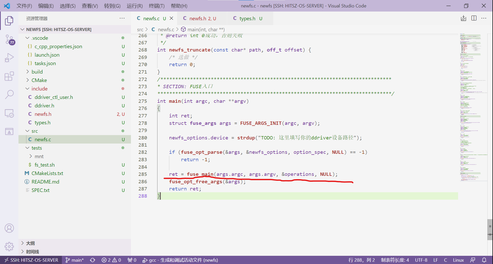

本次实验由于实现的功能较为简单，我们只要求同学们实现以下钩子（其中标记为**NULL**的在本次实验中不要求实现）：

```c
// Line 21 
static struct fuse_operations operations = {
	.init = newfs_init,						 /* mount文件系统 */		
	.destroy = newfs_destroy,				 /* umount文件系统 */
	.mkdir = newfs_mkdir,					 /* 建目录，mkdir */
	.getattr = newfs_getattr,				 /* 获取文件属性，类似stat，必须完成 */
	.readdir = newfs_readdir,				 /* 填充dentrys */
	.mknod = newfs_mknod,					 /* 创建文件，touch相关 */
	.write = NULL,						     /* 写入文件 */
	.read = NULL,							 /* 读文件 */
	.utimens = newfs_utimens,				 /* 修改时间，忽略，避免touch报错 */
	.truncate = NULL,						 /* 改变文件大小 */
	.unlink = NULL,                          /* 删除文件 */
	.rmdir	= NULL, 						 /* 删除目录， rm -r */
	.rename = NULL,							 /* 重命名，mv */

	.open = NULL,							
	.opendir = NULL,
	.access = NULL
};
```

接下来，我们再分别介绍各个操作实现要经过的钩子函数，以便让同学们有个更直观的理解。

### 3.1 挂载

当挂载FUSE文件系统时，会**执行的钩子**是`.init`，我们可以在`.init`钩子中完成**超级块的读取**、**位图的建立**、**驱动的初始化**等操作：

```c
/**
 * @brief 挂载（mount）文件系统
 * 
 * @param conn_info 可忽略，一些建立连接相关的信息 
 * @return void*
 */
void* newfs_init(struct fuse_conn_info * conn_info) {
	/* TODO: 在这里进行挂载 */

	/* 下面是一个控制设备的示例 */
	super.fd = ddriver_open(newfs_options.device);
	
	return NULL;
}
```

上面的示例是初始化驱动设备，其中`newfs_options`为自定义参数，这里我们不对**自定义参数**做更多的介绍，大家会用即可。

### 3.2 卸载

当卸载FUSE文件系统时，会**执行的钩子**是`.destroy`，我们可以在`.destroy`钩子中完成**超级块回写设备**、**驱动的关闭**、**更多必要结构的回写**等操作，以保证下一次挂载能够**恢复ddriver设备中的数据**：

```c
/**
 * @brief 卸载（umount）文件系统
 * 
 * @param p 可忽略
 * @return void
 */
void newfs_destroy(void* p) {
	/* TODO: 在这里进行卸载 */
	
	ddriver_close(super.fd);

	return;
}
```

上面的示例是关闭驱动设备。

### 3.3 获取文件属性

**FUSE文件系统为了获得每个文件的状态**，要不断调用`getattr`钩子，这个钩子函数类似于**xv6**里的**fstat**。实现`ls`、`mkdir`、`touch`等操作的前提就是完成`getattr`钩子的编写，这里给个例子：

```c
/**
 * @brief 获取文件属性
 * 
 * @param path 相对于挂载点的路径
 * @param sfs_stat 返回状态
 * @return int 
 */
int sfs_getattr(const char* path, struct stat * sfs_stat) {
	boolean	is_find, is_root;
	struct sfs_dentry* dentry = sfs_lookup(path, &is_find, &is_root);
	...
        
	if (SFS_IS_DIR(dentry->inode)) {
		sfs_stat->st_mode = S_IFDIR | SFS_DEFAULT_PERM;
		sfs_stat->st_size = dentry->inode->dir_cnt * sizeof(struct sfs_dentry_d);
	}
	else if (SFS_IS_REG(dentry->inode)) {
		sfs_stat->st_mode = S_IFREG | SFS_DEFAULT_PERM;		/* SFS_DEFAULT_PERM 0777 */
		sfs_stat->st_size = dentry->inode->size;
	}

	sfs_stat->st_nlink = 1;
	sfs_stat->st_uid 	 = getuid();
	sfs_stat->st_gid 	 = getgid();
	sfs_stat->st_atime   = time(NULL);
	sfs_stat->st_mtime   = time(NULL);
	sfs_stat->st_blksize = SFS_IO_SZ();

	if (is_root) {
		sfs_stat->st_size	= sfs_super.sz_usage; 
		sfs_stat->st_blocks = SFS_DISK_SZ() / SFS_IO_SZ();
		sfs_stat->st_nlink  = 2;		/* !特殊，根目录link数为2 */
	}
	return SFS_ERROR_NONE;
}
```

`getattr`的实现首先是**解析路径**，从而获取相应文件的**inode或dentry**，接着填写`struct stat*`结构体即可。

### 3.4 建立文件

当为FUSE文件系统创建文件时，会**执行的钩子**是`.mknod`，在我们给的框架中，给了一个简单的思路：

```c
/**
 * @brief 创建文件
 * 
 * @param path 相对于挂载点的路径
 * @param mode 创建文件的模式，可忽略
 * @param dev 设备类型，可忽略
 * @return int 0成功，否则失败
 */
int newfs_mknod(const char* path, mode_t mode, dev_t dev) {
	/* TODO: 解析路径，并创建相应的文件 */
	return 0;
}
```

但仅仅实现这个函数`touch`一个文件仍然会报错，这是因为`touch`要求不仅仅是创建文件，还要求可以**修改文件的访问时间**（难怪叫`touch`，摸一下），因此我们还要实现`utimens`钩子，这个钩子用于修改文件的访问时间（其实只需要返回0就好）。这个函数可以进一步完善，也可以不完善。

```c
/**
 * @brief 修改时间，为了不让touch报错 
 * 
 * @param path 相对于挂载点的路径
 * @param tv 实践
 * @return int 0成功，否则失败
 */
int newfs_utimens(const char* path, const struct timespec tv[2]) {
	(void)path;
	return 0;
}
```

### 3.5 建立目录

当为FUSE文件系统创建目录时，会**执行的钩子**是`.mkdir`：

```c
/**
 * @brief 创建目录
 * 
 * @param path 相对于挂载点的路径
 * @param mode 创建模式（只读？只写？），可忽略
 * @return int 0成功，否则失败
 */
int newfs_mkdir(const char* path, mode_t mode) {
	/* TODO: 解析路径，创建目录 */
	return 0;
}
```

### 3.6 读取目录项

当**在FUSE文件系统**下调用`ls`时，就会触发`readdir`钩子，**readdir**在`ls`的过程中每次**仅会返回一个目录项**，其中`offset`参数记录着当前应该返回的目录项：

```c
int sfs_readdir(const char * path, void * buf, fuse_fill_dir_t filler, off_t offset,
			    struct fuse_file_info * fi) {
    boolean	is_find, is_root;
	int		cur_dir = offset;
	...
	if (is_find) {
        ...
		dentry = sfs_get_dentry(inode, cur_dir);
		if (dentry) {
			filler(buf, fname, NULL, ++offset);
		}
		return SFS_ERROR_NONE;
	}
	return -SFS_ERROR_NOTFOUND;
}
```

其中最重要的**filler**函数，**filler**函数原型如下：

```c
 typedef int (*fuse_fill_dir_t) (void *buf, const char *name, const struct stat *stbuf, off_t off)
```

对各个参数做如下解释：

 * `buf`：name会被复制到buf中；
 * `name`：dentry名字；
 * `stbuf`：文件状态，可忽略；
 * `off`： 下一次offset从哪里开始，这里可以理解为第几个dentry；

因此，在上述代码中，我们调用`filler(buf, fname, NULL, ++offset)`表示将`fname`放入`buf`中，并使目录项偏移加一，代表下一次访问下一个目录项。

## 4. 实现建议

### 4.1 参考代码

本次实验可以参考两个完全搭建好的FUSE文件系统：`simplefs`（`fs/simplefs`文件夹下）和`myfs`（`fs/samples`文件夹下），其中`simplefs`是一个类EXT2的文件系统，但**没有给予数据位图**的实现；`myfs`是`github`上的一个开源项目，也是一个FUSE文件系统实例。

### 4.2 实现步骤建议

- 封装对**ddriver**的访问代码，方便设备读写；
- 设计介质数据结构（位于`types.h`）；
- 设计内存数据结构（可设计、可不设计）；
- 完成`.init`钩子：读**超级块**、初始化文件系统；
- 完成`.destroy`钩子：**回写必要结构**，保证下一次挂载正常；
- 验证挂载卸载流程的正确性（**主要看读写是否正确**）；
- 完成工具函数（可自行设计）：
  - 完成**分配inode**函数：创建一个Inode、初始化其上的字段、修改位图结构，可能还需要修改超级块；
  - 完成**分配dentry**函数：创建一个dentry、初始化其上的字段；
  - 完成将**dentry加入到inode**中的函数：将生成的dentry写入到inode中；
  - 完成**路径解析函数**，要么返回dentry，要么返回inode，可自行设计；
- 根据工具函数，完成`.get_attr`钩子；
- 根据工具函数，完成`.mknod`钩子；
- 根据工具函数，完成`.mkdir`钩子；
- 根据工具函数，完成`.readdir`钩子；
- 手工测试`touch`、`ls`、 `mkdir`、`fusermount -u`等命令的正确性；
- 通过`./tests/fs_test.sh`脚本

## 5. 常见问题

### 5.1 如何调试？

按下`F5`后，文件系统运行为前台模式，那么如何输入命令呢？事实上，可以`ctrl + shift +｀`呼出另一个终端，然后在另一个终端操作。

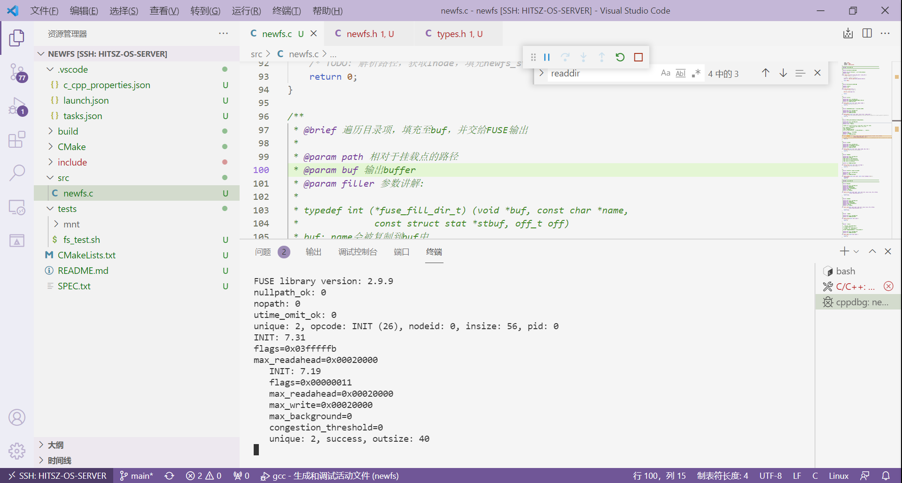

另外，如下图所示，可以按这个**拆分键**，就可以同时显示两个终端了。

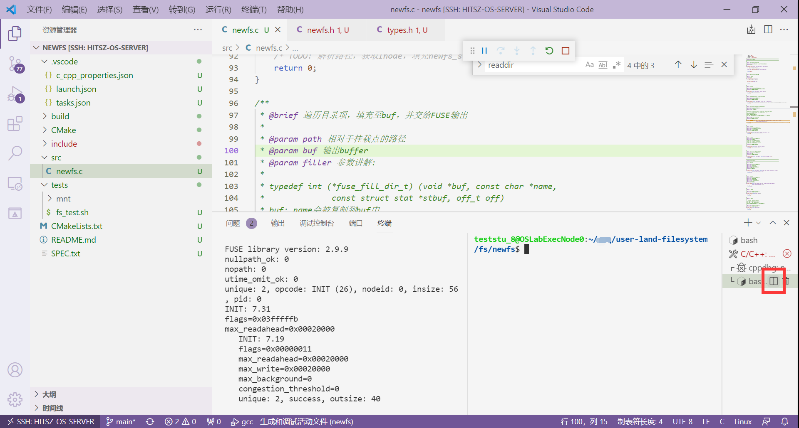

### 5.2 挂载失败？fuse: bad mount point

如下图所示：

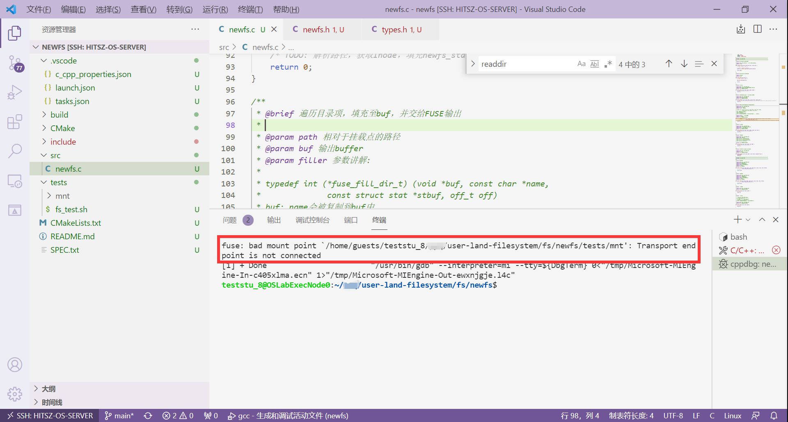

这种情况就是不正常的卸载文件系统，我们显式地调用**卸载文件系统**即可：

```sh
teststu_8@OSLabExecNode0:~/pyq/user-land-filesystem/fs/newfs$ fusermount -u ./tests/mnt
teststu_8@OSLabExecNode0:~/pyq/user-land-filesystem/fs/newfs$ 
```

### 5.3 挂载点不空？mountpoint is not empty

如下图所示：

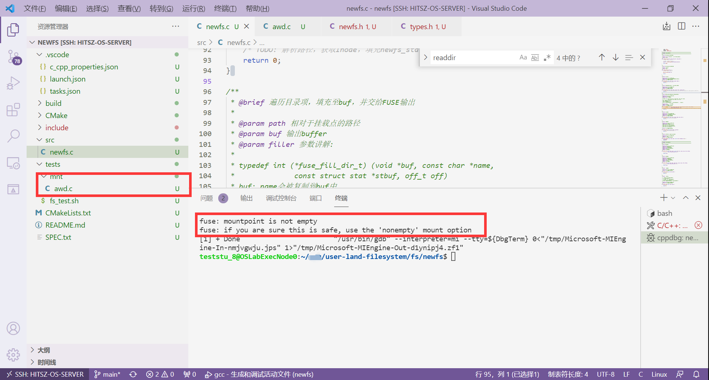

这种情况就是在测试的时候，不小心给`mnt`文件夹下创建了一个文件，导致错误发生，把**文件删除**就行。

